```YAML
nyemoon@github ~ [session: active]
```

```bash
$ whoami
```

```YAML
Ketlyn Barbosa · alias: Nyemoon · Frontend Developer & Software Engineering Student
"As trevas não prevalecem sobre as luas — nascem do escuro e iluminam tudo ao redor."
```

```bash
$ cat skills.conf
```

```ini
[focus & roles]              Frontend UI/UX · Responsive Design · Open-Source Collaborations
[languages]                  JavaScript (ES6+) · HTML5 · CSS3 · Python
[frameworks & libraries]     React · Vue · Vite · Bootstrap
[backend & database]         Node.js · SQL (MySQL)
[tools & devops]             Git & GitHub · VS Code · Linux / Bash Terminal
```

```bash
$ cat phase.sh --progress
```




```bash
$ _
```

<br/>

<div align="center">
  <a href="https://www.linkedin.com/in/ketlyn-barbosa-a995833aa">
    
  </a>
  &nbsp;
  <a href="https://github.com/Nyemoon">
    
  </a>
  &nbsp;
  <a href="mailto:ketlynbarbosa783@gmail.com">
    
  </a>
</div>

<br/>

<div align="center">
  <sub>✦ lua nova — nasce do escuro, cresce para a luz ✦</sub>
</div>